This document describes the workflow used to analyze the effectiveness of different governance types in Peru, following the study available at <https://doi.org/10.21203/rs.3.rs-4170734/v1>. The workflow is executable with a sample of the full dataset for one governance type: mining concessions. To obtain the complete dataset, please contact the authors.

The functions required to run this reproducible workflow are stored in the `functions/` folder, and the example input data are stored in the `inputs/` folder. The script keeps these functions outside the main workflow so that the analysis can be read step by step.


The main helper functions are:

- `multicol_analysis`: checks whether the candidate covariates are highly correlated or aliased, and returns a smaller set of variables for modeling.
- `bestmodels_test`: compares candidate treatment models and selects the best-ranked covariate set.
- `reduce_autocor_by_distance`: checks spatial autocorrelation in the treatment model residuals and iteratively removes locally autocorrelated pixels until the global pattern is reduced.
- `moran_by_distance`: computes the global Moran's I statistic for model residuals at a given distance.
- `moran_plot`: compares global spatial autocorrelation before and after the spatial pruning step.
- `counterfactual_function`: runs the counterfactual matching internally with `MatchIt::matchit`, matching treated pixels to comparable control pixels using the selected covariates.
- `effectivenes_analysis_glm`: estimates treatment-control differences after matching, using binomial models for forest loss and Gaussian models for continuous outcomes such as carbon emissions.
- `make_change_plot`: builds the bar plots that combine observed changes, confidence intervals, and model-based estimates.

```{r setup, include=FALSE}
getExportedValue(paste0("kni", "tr"), "opts_chunk")$set(
  echo = TRUE,
  message = FALSE,
  warning = FALSE,
  results = "hide",
  fig.align = "center"
)

options(repos = c(CRAN = "https://cloud.r-project.org"))

dir_work <- normalizePath(getwd(), winslash = "/", mustWork = TRUE)
setwd(dir_work)

```

## Environment

The workflow uses standard spatial, matching, modeling, and plotting packages. Missing packages are installed automatically.

```{r environment}
packages_list <- c(
  "magrittr", "data.table", "dplyr", "tidyr", "tibble", "purrr", "plyr",
  "ggplot2", "ggdendro", "ggnewscale", "ggbeeswarm", "ggpubr", "scales",
  "RColorBrewer", "MatchIt", "cobalt", "igraph", "leaps", "pbapply",
  "rlang", "car", "DescTools", "broom.mixed", "dbscan", "Matrix",
  "RSpectra"
)

packages_list <- unique(packages_list)
packages_prev <- .packages(all.available = TRUE)

invisible(lapply(packages_list, function(x) {
  if(!x %in% packages_prev) install.packages(x, force = TRUE)
}))

invisible(lapply(packages_list, library, character.only = TRUE))
```

## Inputs

The reproducible example uses the mining concessions sample stored in `inputs/data_MC.rds`. The response variable is `MC`, where treated pixels belong to mining concessions and control pixels do not.

This block defines the columns used throughout the workflow. `Forest2005` and `Forest2021` are used to measure forest loss, while `Carbon2005` and `Carbon2021` are used to measure carbon emissions. The columns `id_site` and `area_site` identify the mining concession site and its area, which are needed later for the site-level analysis.

```{r inputs}
path_data <- file.path(dir_work, "inputs", "data_MC.rds")
path_functions <- file.path(dir_work, "functions", "functions.R")

treatment_col <- "MC"

col_forest_t1 <- "Forest2005"
col_forest_t2 <- "Forest2021"

col_carbon_t1 <- "Carbon2005"
col_carbon_t2 <- "Carbon2021"

col_site <- "id_site"
col_area_site <- "area_site"

cor_threshold <- 0.65

covars_list <- list(
  numeric = c(
    "Anual_Prec", "D17Set10", "D17Set1000", "D17Set10000", "D17Set5000",
    "D7Set10", "D7Set1000", "D7Set10000", "D7Set5000",
    "defor_2000_2005_10km2", "defor_2000_2005_1km2",
    "Departme_R", "Dis_Def", "Dis_Rivers", "District_R",
    "Elevation", "National_R", "Pop2000", "Pop2020", "Prec_Seas",
    "Slope", "Tra_Time00", "Tra_Time15"
  ),
  factor = c("Department", "Ecoregions")
)

source(path_functions, encoding = "UTF-8")

data_PUID <- readRDS(path_data)
covars_test <- unlist(covars_list)

table(data_PUID[[treatment_col]])
```

## Prepare Variables

Categorical variables are compressed into a single numeric score using the first principal component of their dummy matrix. This keeps the example compact while allowing categorical information to enter the model-selection step.

The categorical variables are first converted into dummy variables with `model.matrix`. Then the first principal component summarizes the main contrast among categories. This is a compact alternative to carrying many dummy columns through every later model in the reproducible example.

```{r prepare-variables}
covars_factor <- covars_list$factor

if(!is.null(covars_factor) | length(covars_factor) < 1) {
  
  data_PUID2 <- data_PUID
  
  for(i in covars_factor) {
    data_PUID2 <- data_PUID2 %>% 
      dplyr::mutate(!!rlang::sym(i) := factor(!!rlang::sym(i), exclude = NULL))
    
    dummy <- model.matrix(as.formula(paste0("~", i, "-1")), data = data_PUID2)
    pca_1 <- prcomp(dummy, center = TRUE, scale. = FALSE)$x[, 1]
    
    data_PUID2 <- data_PUID2 %>% 
      dplyr::mutate(!!rlang::sym(i) := pca_1)
  }
  
} else {
  data_PUID2 <- data_PUID
}
```

## Covariate Selection

The first selection step removes highly correlated or aliased covariates. Variables marked with an asterisk in the dendrogram are retained for the next stage.

Here, `multicol_analysis` is used as a screening step. It receives the treatment column, the candidate covariates, and a correlation threshold. It returns the variables that can be kept without carrying strong multicollinearity into the matching model.

```{r multicollinearity}
multicol_test <- multicol_analysis(
  data_x = data_PUID2,
  treatment_col_x = treatment_col,
  cor_threshold_x = cor_threshold,
  covars_x = covars_test,
  covars_x_key = c("defor_2000_2005_1km2", "defor_2000_2005_10km2")
)

covars_no_multicol <- multicol_test$covars_no_multicol

multicol_test$multicol_dendro_plot

```

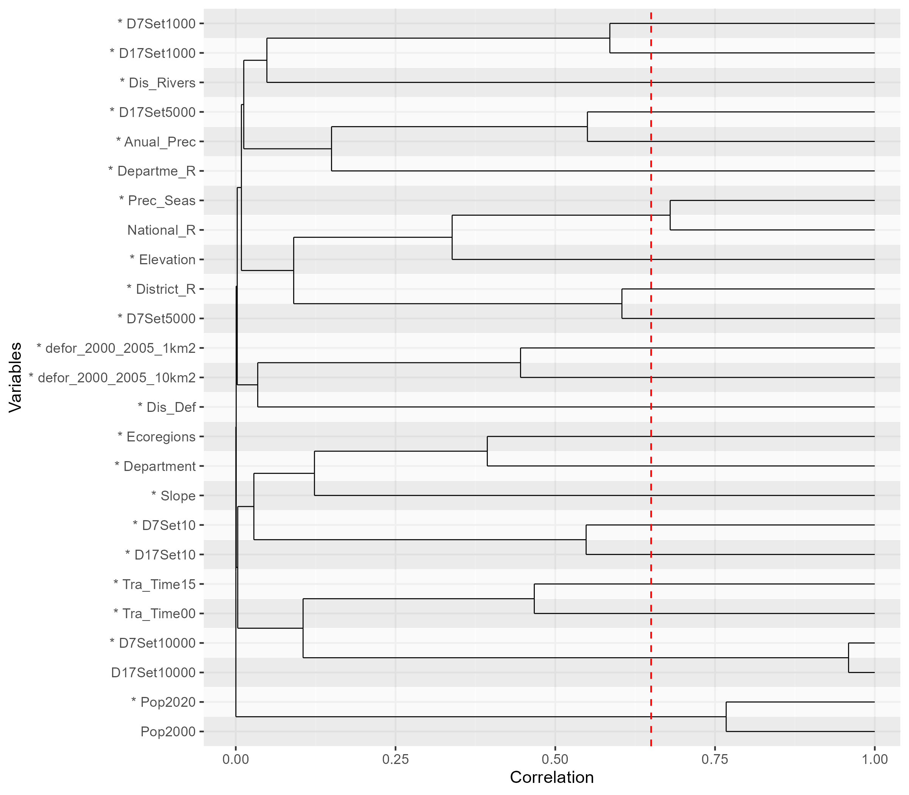

The second selection step compares candidate treatment models and keeps the best-ranked set of covariates according to AIC. This is done with `bestmodels_test`, which fits alternative treatment models and ranks them. The selected variables are then used for the spatial autocorrelation check and for the matching step.

```{r model-selection}
model_selection <- bestmodels_test(
  data_x = data_PUID2,
  treatment_col_x = treatment_col,
  covars_x = covars_no_multicol,
  covars_x_key = c("defor_2000_2005_1km2", "defor_2000_2005_10km2"),
  criteria_x = "AIC"
)

covars_better_model <- as.character(model_selection[["list_models"]][[1]]$vars)
selected_vars <- c(col_forest_t1, covars_better_model)

model_selection$better_models_plot

```

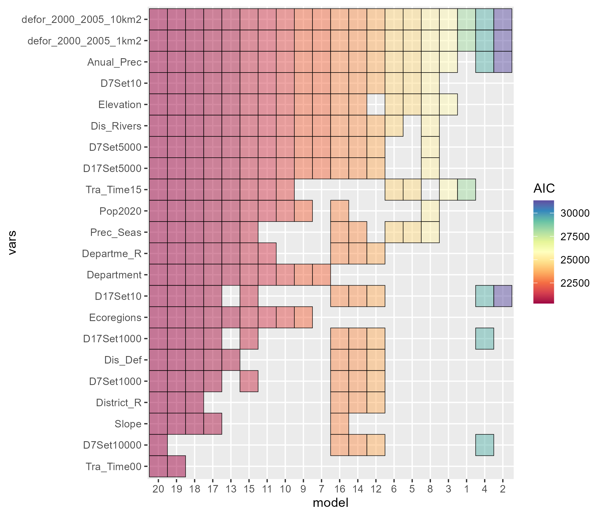

## Spatial Autocorrelation

The treatment model is checked for residual spatial autocorrelation and then adjusted by pruning locally autocorrelated pixels within a 1 km neighborhood.

The function `reduce_autocor_by_distance` does this iteratively. In each iteration, it fits a binomial treatment model, computes residuals, builds a spatial neighborhood within the chosen distance, and identifies pixels that contribute to local Moran autocorrelation. Those locally autocorrelated pixels are pruned, and the model is checked again. The process stops when the remaining data have low global Moran autocorrelation or when no further local autocorrelation is detected.

After that, `moran_plot` uses `moran_by_distance` internally to summarize the global Moran's I statistic at several distances. This figure is a diagnostic: it shows whether the spatial pruning reduced residual autocorrelation not only at 1 km, but also at nearby scales such as 600 m and 5 km.

```{r spatial-autocorrelation}
data_adjust_autocor <- reduce_autocor_by_distance(
  data_x = data_PUID2,
  treatment_col_x = treatment_col,
  covars_x = selected_vars,
  distance_x = 1000
)

moran_plot_autocor <- moran_plot(
  list_autocor = data_adjust_autocor,
  treatment_col_x = treatment_col,
  covars_x = selected_vars,
  distances = c(600, 1000, 5000)
)

moran_plot_autocor

```

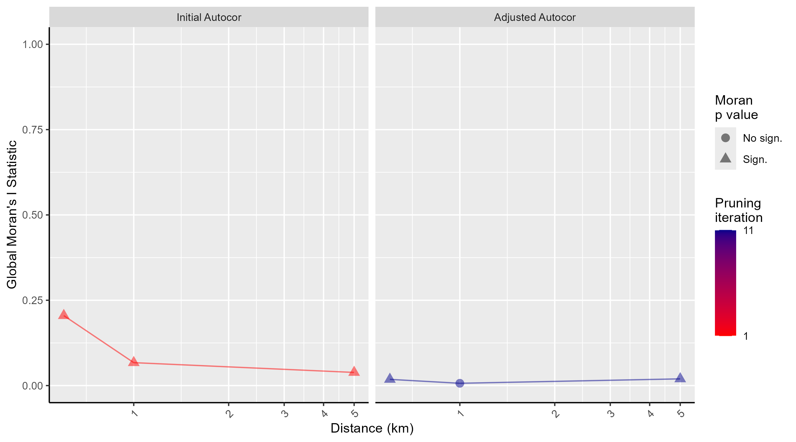

## Matching

Propensity-score matching is used to select comparable treated and control pixels. The workflow then checks covariate balance and propensity-score overlap after matching.

The function `counterfactual_function` is the matching wrapper. Internally, it calls `MatchIt::matchit` to estimate propensity scores and match treated pixels to control pixels with similar covariate values. The output includes the matched dataset, a balance plot, and a propensity-score overlap plot. The goal is to make the post-matching control pixels a plausible counterfactual for the treated mining concession pixels.

```{r matching}
matching_analysis <- counterfactual_function(
  data_x = data_adjust_autocor$PUID_noautocor,
  treatment_col_x = treatment_col,
  covars_x = selected_vars,
  caliper_test = 0.2
)

matching_analysis$vars_imbalance_plot
matching_analysis$ps_plot

```

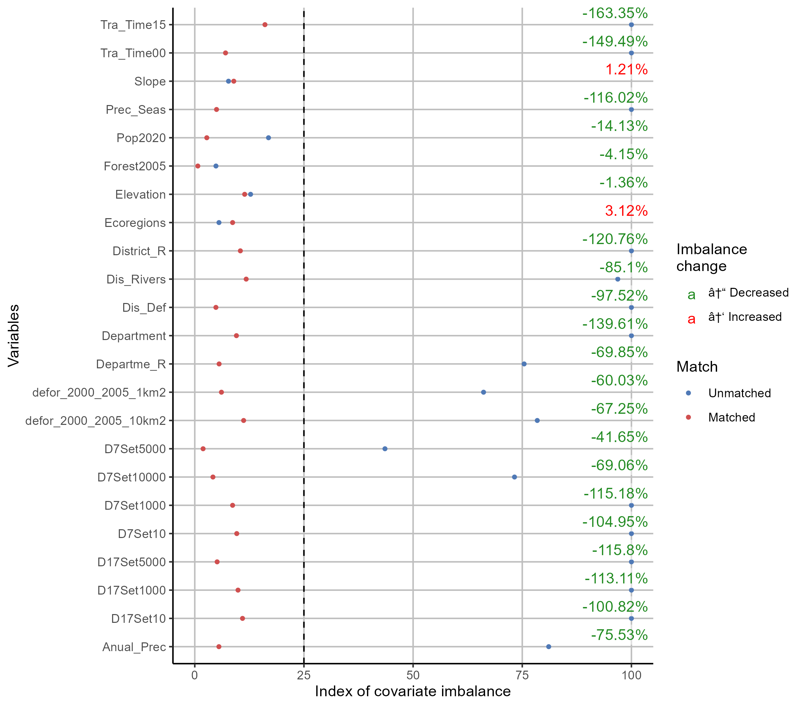

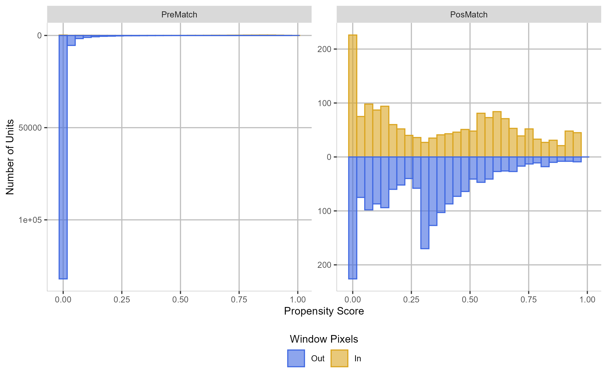

## Post-Matching Data

After matching, the analysis keeps pixels that were forested at baseline. Forest loss and carbon emissions are then computed between 2005 and 2021.

This block creates the outcome variables used in the effectiveness analysis. `deforest` is equal to 1 when a pixel was forested in 2005 and not forested in 2021. `carbon_emmisions` is the carbon stock difference between 2005 and 2021, so larger values indicate larger carbon losses.

```{r post-matching-data}
matched_data <- matching_analysis$matched_df %>% 
  dplyr::filter(!!rlang::sym(col_forest_t1) > 0) %>% 
  dplyr::mutate(
    deforest = ifelse(
      !!rlang::sym(col_forest_t1) == 1 & !!rlang::sym(col_forest_t2) == 0,
      1,
      0
    ),
    forest_persistence = ifelse(
      !!rlang::sym(col_forest_t1) == 1 & !!rlang::sym(col_forest_t2) == 0,
      0,
      1
    ),
    carbon_emmisions = !!rlang::sym(col_carbon_t1) - !!rlang::sym(col_carbon_t2)
  ) %>% 
  as.data.frame()
```

## Pixel-Level Analysis

The first post-matching analysis estimates average pixel-level forest loss and carbon emissions for treated and control pixels.

The function `effectivenes_analysis_glm` summarizes the observed change in each group and tests whether the treated and control groups differ after matching. For forest loss, the function uses a binomial GLM because the outcome is binary. For carbon emissions, it uses a Gaussian model because the outcome is continuous. The `transform_value = -1` argument is used so that the plotted direction is interpreted as avoided loss or reduced emissions.

The function `make_change_plot` then converts those summaries into the displayed plots. The bars show observed average changes for control and treatment pixels, while the model estimate reports the fitted treatment-control difference.

```{r pixel-forest}
deforest_test <- effectivenes_analysis_glm(
  data_x = matched_data,
  treatment_col_x = treatment_col,
  col_change_t1_x = col_forest_t1,
  col_change_t2_x = col_forest_t2,
  col_change = "deforest",
  family_distribution = "binomial",
  transform_value = -1
)

deforest_change_plot_data <- deforest_test$data_change %>% 
  dplyr::mutate(term = treatment_col) %>% 
  dplyr::rename(
    change_prop = change,
    change_prop_lwr = change_lwr,
    change_prop_upr = change_upr
  )

deforest_change_sign_plot_data <- deforest_test$summ_sign_change %>% 
  dplyr::mutate(term = treatment_col)

aes_x_mc <- data.frame(
  term = treatment_col,
  label_x = "Mining concessions"
)

aes_fill_mc <- data.frame(
  treatment = c("0", "1", "modFixed_estimate"),
  label_fill = c("Control post-matching", "Treatment", "Model coefficient"),
  color_fill = c("rosybrown1", "lightgoldenrodyellow", "#CCCCCC")
)

deforest_plot <- make_change_plot(
  data_change = deforest_change_plot_data,
  data_change_sign = deforest_change_sign_plot_data,
  metric_change_plot = "RAD_adjusted_treatment",
  color_metric_change_plot = "RAD_adjusted_treatment",
  model_plot = "modFixed",
  aes_x_plot = aes_x_mc,
  aes_fill_plot = aes_fill_mc,
  xlab_title = "",
  ylab_title = "Forest change"
)

deforest_plot

```

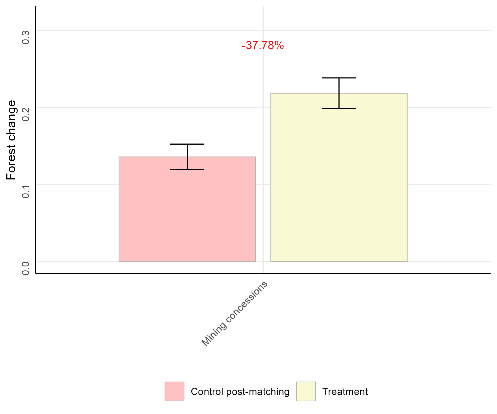

```{r pixel-carbon}
CO2emissions_test <- effectivenes_analysis_glm(
  data_x = matched_data,
  treatment_col_x = treatment_col,
  col_change_t1_x = col_carbon_t1,
  col_change_t2_x = col_carbon_t2,
  col_change = "carbon_emmisions",
  family_distribution = "gaussian",
  transform_value = -1
)

CO2emissions_change_plot_data <- CO2emissions_test$data_change %>% 
  dplyr::mutate(
    term = treatment_col,
    treatment = as.character(treatment),
    change = change_t1_t2
  ) %>% 
  dplyr::rename(
    change_prop = change,
    change_prop_lwr = change_lwr,
    change_prop_upr = change_upr
  )

CO2emissions_change_sign_plot_data <- CO2emissions_test$summ_sign_change %>% 
  dplyr::mutate(term = treatment_col)

CO2emissions_plot <- make_change_plot(
  data_change = CO2emissions_change_plot_data,
  data_change_sign = CO2emissions_change_sign_plot_data,
  metric_change_plot = "RAD_adjusted_treatment",
  color_metric_change_plot = "RAD_adjusted_treatment",
  model_plot = "modFixed",
  aes_x_plot = aes_x_mc,
  aes_fill_plot = aes_fill_mc,
  xlab_title = "",
  ylab_title = "Carbon emissions"
)

CO2emissions_plot

```

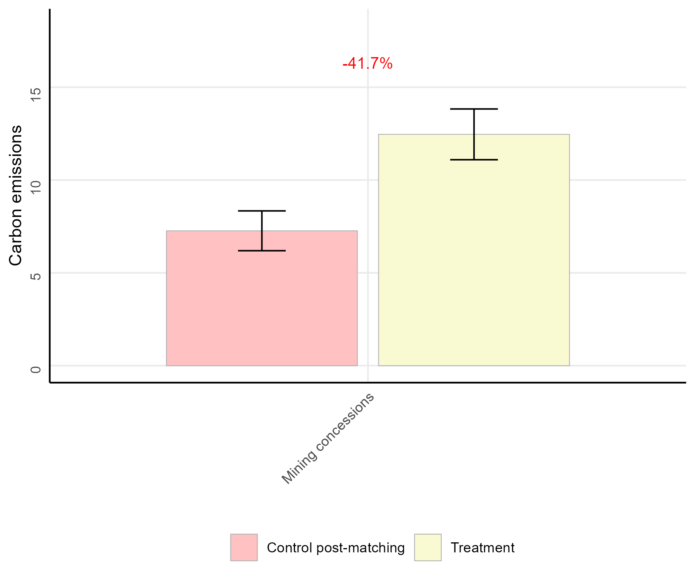

## Mean Pixel Analysis by Site

This step repeats the post-matching analysis by mining concession site. For each treated site, the matched subclasses that contain pixels from that site are used to compare treated and control pixels.

The purpose of this section is to avoid letting large sites dominate the interpretation only because they contain many pixels. First, the code identifies each treated site and the matched subclasses linked to that site. Then it reruns `effectivenes_analysis_glm` within those matched subclasses. Finally, it averages the site-level results so that the figure represents the mean pixel response by site.

```{r site-analysis}
matched_data_site <- matched_data %>% 
  dplyr::filter(!is.na(!!rlang::sym(col_site)))

matched_subclasses <- matched_data %>% 
  dplyr::group_by(subclass) %>% 
  dplyr::filter(dplyr::n_distinct(!!rlang::sym(treatment_col)) > 1) %>% 
  dplyr::ungroup() %>% 
  dplyr::pull(subclass) %>% 
  unique()

list_sites <- matched_data_site %>% 
  dplyr::filter(
    subclass %in% matched_subclasses,
    !!rlang::sym(treatment_col) == 1
  ) %>% 
  split(.[[col_site]])

data_sites <- pbapply::pblapply(list_sites, function(site_data) {
  
  site_x <- dplyr::first(site_data[[col_site]])
  area_x <- dplyr::first(site_data[[col_area_site]])
  vals <- as.character(unique(site_data$subclass))
  
  matched_data_y <- matched_data %>% 
    dplyr::filter(subclass %in% vals)
  
  deforest_test_site <- tryCatch({
    effectivenes_analysis_glm(
      data_x = matched_data_y,
      treatment_col_x = treatment_col,
      col_change_t1_x = col_forest_t1,
      col_change_t2_x = col_forest_t2,
      col_change = "deforest",
      family_distribution = "binomial",
      transform_value = -1
    ) %>% 
      lapply(function(x) {
        dplyr::mutate(
          x,
          term = treatment_col,
          id_site = site_x,
          area_site = area_x
        )
      })
  }, error = function(e) NULL)
  
  CO2emissions_test_site <- tryCatch({
    effectivenes_analysis_glm(
      data_x = matched_data_y,
      treatment_col_x = treatment_col,
      col_change_t1_x = col_carbon_t1,
      col_change_t2_x = col_carbon_t2,
      col_change = "carbon_emmisions",
      family_distribution = "gaussian",
      transform_value = -1
    ) %>% 
      lapply(function(x) {
        dplyr::mutate(
          x,
          term = treatment_col,
          id_site = site_x,
          area_site = area_x
        )
      })
  }, error = function(e) NULL)
  
  list(
    deforest_test = deforest_test_site,
    CO2emissions_test = CO2emissions_test_site
  )
})
```

```{r site-forest-plot}
forest_sites_data_change <- purrr::map(data_sites, "deforest_test") %>% 
  purrr::compact() %>% 
  purrr::map("data_change") %>% 
  plyr::rbind.fill()

forest_sites_summ_sign_change <- purrr::map(data_sites, "deforest_test") %>% 
  purrr::compact() %>% 
  purrr::map("summ_sign_change") %>% 
  plyr::rbind.fill()

forest_sites_data_change <- forest_sites_data_change %>% 
  dplyr::mutate(
    treatment = as.character(treatment),
    change_prop = change,
    change_prop_lwr = change_lwr,
    change_prop_upr = change_upr
  )

mean_forest_sites <- forest_sites_data_change %>% 
  dplyr::filter(!is.na(change_prop)) %>% 
  dplyr::group_by(id_site, term, treatment) %>% 
  dplyr::summarise(change_prop = mean(change_prop, na.rm = TRUE), .groups = "drop") %>% 
  dplyr::group_by(term, treatment) %>% 
  dplyr::summarise(
    change_prop_lwr = ifelse(dplyr::n() > 1, t.test(change_prop)$conf.int[1], NA_real_),
    change_prop_upr = ifelse(dplyr::n() > 1, t.test(change_prop)$conf.int[2], NA_real_),
    change_prop = mean(change_prop, na.rm = TRUE),
    ndata = dplyr::n_distinct(id_site),
    .groups = "drop"
  )

aes_x_sites <- mean_forest_sites %>% 
  dplyr::distinct(term, ndata) %>% 
  dplyr::mutate(label_x = paste0("Mining concessions\n(", ndata, ")"))

delta_mean_forest_sites <- mean_forest_sites %>% 
  dplyr::group_by(term) %>% 
  dplyr::summarise(
    change_mean_treatment = change_prop[treatment == "1"],
    change_mean_control = change_prop[treatment == "0"],
    RAD_adjusted_mean_treatment = (
      (change_mean_treatment - change_mean_control) /
        pmax(abs(change_mean_treatment), abs(change_mean_control), 1e-9)
    ) * -100,
    .groups = "drop"
  )

test_forest_sites_sign <- forest_sites_data_change %>% 
  split(.$term) %>% 
  purrr::imap(function(x, name) {
    effectivenes_analysis_glm(
      data_x = x,
      treatment_col_x = "treatment",
      col_change_t1_x = "mean_t1",
      col_change_t2_x = "mean_t2",
      col_change = "change_prop",
      family_distribution = "gaussian",
      transform_value = -1
    )[["summ_sign_change"]] %>% 
      dplyr::mutate(term = name)
  }) %>% 
  plyr::rbind.fill() %>% 
  list(delta_mean_forest_sites) %>% 
  plyr::join_all()

forest_mean_sites_plot <- make_change_plot(
  data_change = mean_forest_sites,
  data_change_sign = test_forest_sites_sign,
  metric_change_plot = "RAD_adjusted_mean_treatment",
  color_metric_change_plot = "RAD_adjusted_mean_treatment",
  model_plot = "modFixed",
  aes_x_plot = aes_x_sites,
  aes_fill_plot = aes_fill_mc,
  xlab_title = "",
  ylab_title = "Forest loss (%)"
)

forest_mean_sites_plot

```

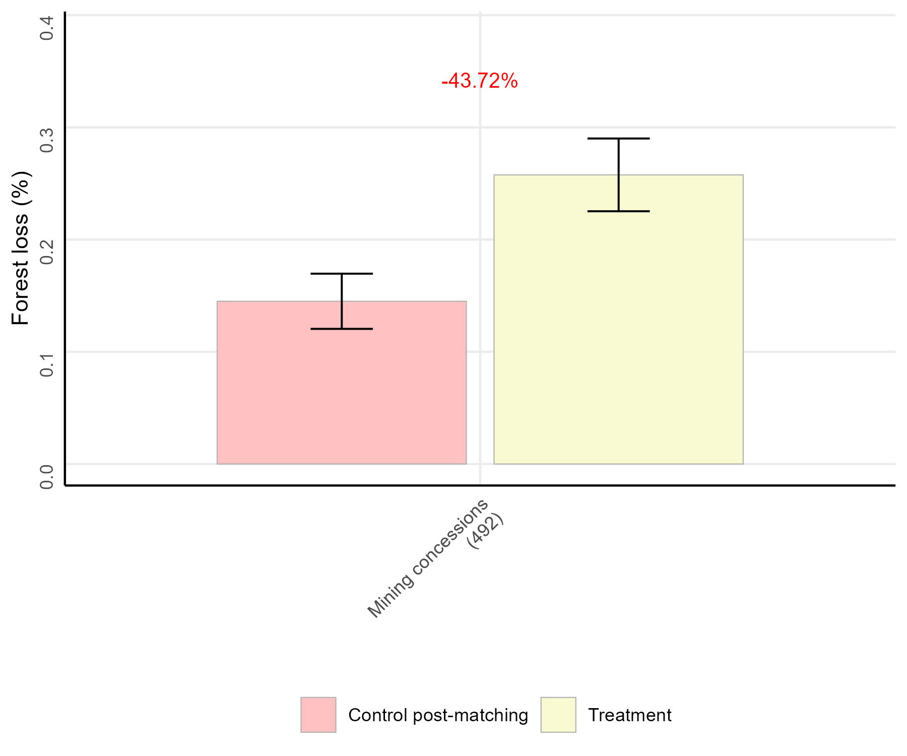

```{r site-carbon-plot}
carbon_sites_data_change <- purrr::map(data_sites, "CO2emissions_test") %>% 
  purrr::compact() %>% 
  purrr::map("data_change") %>% 
  plyr::rbind.fill()

carbon_sites_data_change <- carbon_sites_data_change %>% 
  dplyr::mutate(
    treatment = as.character(treatment),
    change_prop = change_t1_t2,
    change_prop_lwr = change_lwr,
    change_prop_upr = change_upr
  )

mean_carbon_sites <- carbon_sites_data_change %>% 
  dplyr::filter(!is.na(change_prop)) %>% 
  dplyr::group_by(id_site, term, treatment) %>% 
  dplyr::summarise(change_prop = mean(change_prop, na.rm = TRUE), .groups = "drop") %>% 
  dplyr::group_by(term, treatment) %>% 
  dplyr::summarise(
    change_prop_lwr = ifelse(dplyr::n() > 1, t.test(change_prop)$conf.int[1], NA_real_),
    change_prop_upr = ifelse(dplyr::n() > 1, t.test(change_prop)$conf.int[2], NA_real_),
    change_prop = mean(change_prop, na.rm = TRUE),
    ndata = dplyr::n_distinct(id_site),
    .groups = "drop"
  )

delta_mean_carbon_sites <- mean_carbon_sites %>% 
  dplyr::group_by(term) %>% 
  dplyr::summarise(
    change_mean_treatment = change_prop[treatment == "1"],
    change_mean_control = change_prop[treatment == "0"],
    RAD_adjusted_mean_treatment = (
      (change_mean_control - change_mean_treatment) /
        pmax(abs(change_mean_treatment), abs(change_mean_control), 1e-9)
    ) * 100,
    .groups = "drop"
  )

test_carbon_sites_sign <- carbon_sites_data_change %>% 
  split(.$term) %>% 
  purrr::imap(function(x, name) {
    effectivenes_analysis_glm(
      data_x = x,
      treatment_col_x = "treatment",
      col_change_t1_x = "mean_t1",
      col_change_t2_x = "mean_t2",
      col_change = "change_prop",
      family_distribution = "gaussian",
      transform_value = -1
    )[["summ_sign_change"]] %>% 
      dplyr::mutate(term = name)
  }) %>% 
  plyr::rbind.fill() %>% 
  list(delta_mean_carbon_sites) %>% 
  plyr::join_all()

carbon_mean_sites_plot <- make_change_plot(
  data_change = mean_carbon_sites,
  data_change_sign = test_carbon_sites_sign,
  metric_change_plot = "RAD_adjusted_mean_treatment",
  color_metric_change_plot = "RAD_adjusted_mean_treatment",
  model_plot = "modFixed",
  aes_x_plot = aes_x_sites,
  aes_fill_plot = aes_fill_mc,
  xlab_title = "",
  ylab_title = "Carbon emissions"
)

carbon_mean_sites_plot

```

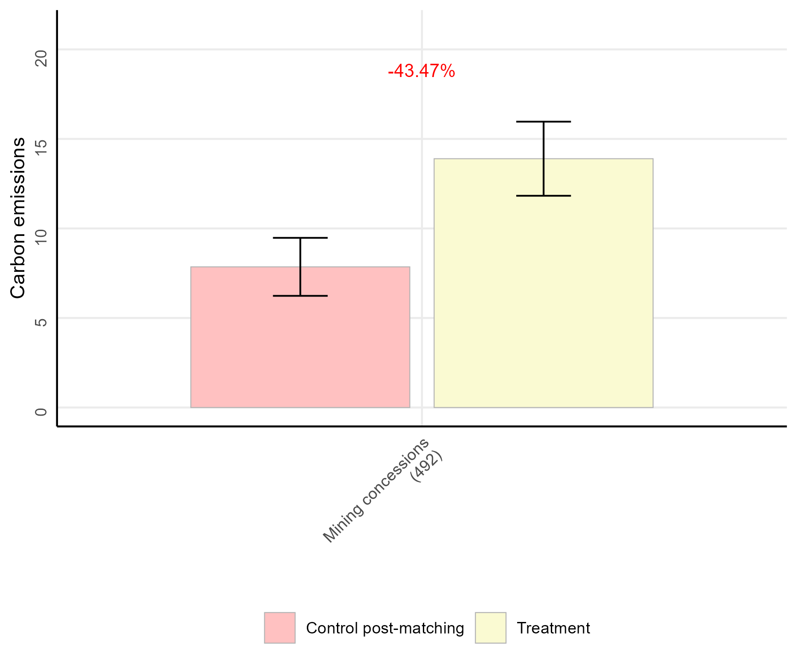

## Site Histograms

These histograms describe the distribution of mining concession site areas and the number of pixels represented by sites of different sizes.

These plots are descriptive. They show whether the reproducible sample is dominated by small or large concessions, and whether most pixels come from a small number of large sites. This helps interpret the site-level results.

```{r site-histograms}
area_sites <- forest_sites_data_change %>% 
  dplyr::filter(treatment == "1") %>% 
  dplyr::distinct(term, id_site, area_site, ndata) %>% 
  dplyr::mutate(
    area_km2 = area_site / 1e6,
    term = as.character(term)
  )

hist_fill_values <- setNames("#8D8D8D", unique(area_sites$term))
hist_fill_labels <- setNames(
  as.character(aes_x_sites$label_x[match(unique(area_sites$term), aes_x_sites$term)]),
  unique(area_sites$term)
)

Hist_PixelsPerSiteArea_detail <- ggplot2::ggplot(
  area_sites,
  ggplot2::aes(x = area_km2, fill = term, weight = ndata)
) +
  ggplot2::geom_histogram(position = "identity", alpha = 1) +
  ggplot2::scale_fill_manual(
    "Governance\ntype",
    values = hist_fill_values,
    labels = hist_fill_labels,
    drop = FALSE
  ) +
  ggplot2::ylab("Pixel count") +
  ggplot2::xlab(expression(Area~(km^2))) +
  ggplot2::theme_minimal() +
  ggplot2::theme(axis.text.x = ggplot2::element_text(angle = 45, hjust = 1))

Hist_PixelsPerSiteArea_General <- ggplot2::ggplot(
  area_sites,
  ggplot2::aes(x = area_km2, fill = term, weight = ndata)
) +
  ggplot2::geom_histogram(position = "identity", alpha = 0.4) +
  ggplot2::scale_fill_manual(
    "Governance\ntype",
    values = hist_fill_values,
    labels = hist_fill_labels,
    drop = FALSE
  ) +
  ggplot2::ylab("Pixel count") +
  ggplot2::xlab(expression(Area~(km^2))) +
  ggplot2::coord_cartesian(xlim = c(1, NA)) +
  ggplot2::theme_minimal() +
  ggplot2::theme(axis.text.x = ggplot2::element_text(angle = 45, hjust = 1))

Hist_SitesPerArea_detail <- ggplot2::ggplot(
  area_sites,
  ggplot2::aes(x = area_km2, fill = term)
) +
  ggplot2::geom_histogram(position = "identity", alpha = 1) +
  ggplot2::scale_fill_manual(
    "Governance\ntype",
    values = hist_fill_values,
    labels = hist_fill_labels,
    drop = FALSE
  ) +
  ggplot2::ylab("Sites count") +
  ggplot2::xlab(expression(Area~(km^2))) +
  ggplot2::theme_minimal() +
  ggplot2::theme(axis.text.x = ggplot2::element_text(angle = 45, hjust = 1))

Hist_SitesPerArea_General <- ggplot2::ggplot(
  area_sites,
  ggplot2::aes(x = area_km2, fill = term)
) +
  ggplot2::geom_histogram(position = "identity", alpha = 0.4) +
  ggplot2::scale_fill_manual(
    "Governance\ntype",
    values = hist_fill_values,
    labels = hist_fill_labels,
    drop = FALSE
  ) +
  ggplot2::ylab("Sites count") +
  ggplot2::xlab(expression(Area~(km^2))) +
  ggplot2::coord_cartesian(xlim = c(1, NA)) +
  ggplot2::theme_minimal() +
  ggplot2::theme(axis.text.x = ggplot2::element_text(angle = 45, hjust = 1))

Hist_PixelsPerSiteArea_detail
Hist_PixelsPerSiteArea_General
Hist_SitesPerArea_detail
Hist_SitesPerArea_General

```

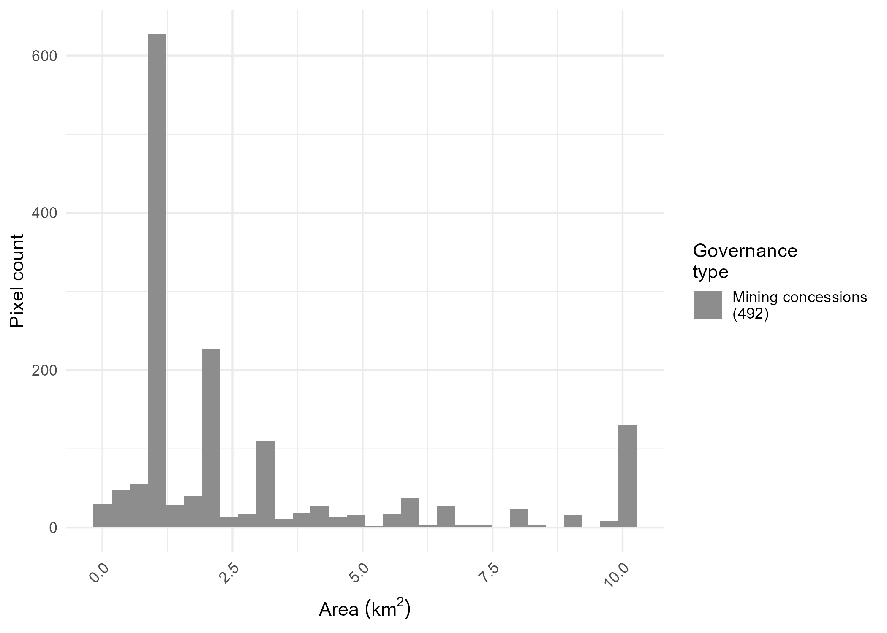

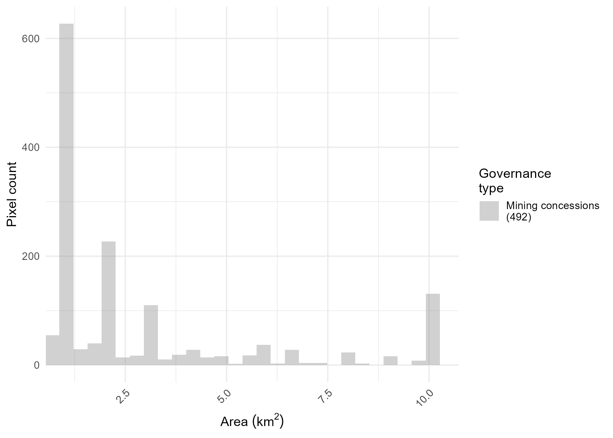

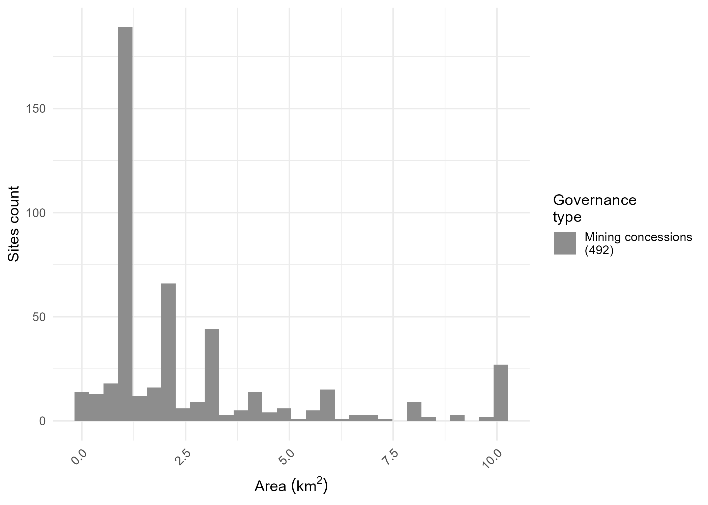

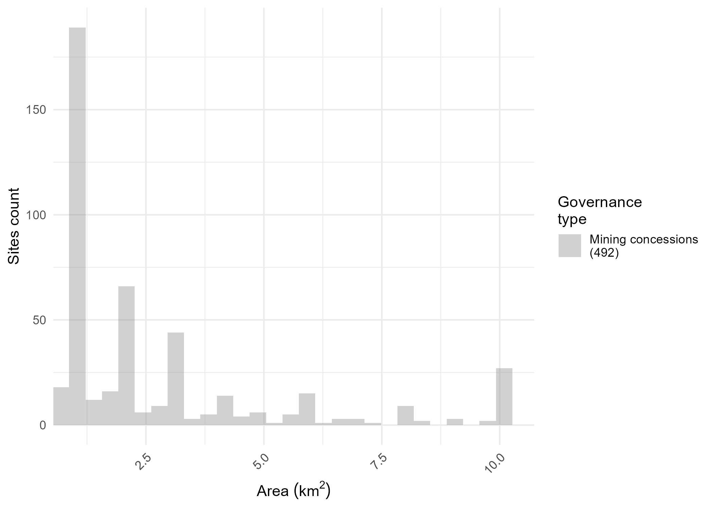

## Change by Site

The final plots summarize site-level avoided forest loss and relative avoided forest loss, both overall and by site-area class.

This section uses the site-level model summaries from the previous analysis. `avoid_forest_loss` reports the absolute avoided forest loss by site, while `RAD_adjusted_treatment` reports the relative avoided forest loss. The plots show both the overall distribution across mining concessions and the distribution by site-area class.

```{r change-by-site}
forest_sites_summ_sign_change <- forest_sites_summ_sign_change %>% 
  dplyr::mutate(
    term = as.character(term),
    area_km2 = area_site / 1e6
  )

site_size_breaks <- c(0, 10, 100, 1000, Inf)
site_size_labels <- c("< 10 km2", "10 - 100 km2", "100 - 1000 km2", ">= 1000 km2")

avoidDefor_sites <- forest_sites_summ_sign_change %>% 
  dplyr::transmute(
    term,
    id_site,
    area_km2,
    site_size = cut(
      area_km2,
      breaks = site_size_breaks,
      labels = site_size_labels,
      include.lowest = TRUE,
      right = FALSE
    ),
    avoid_forest_loss = AD_treatment * 100
  )

eff_avoidDefor_sites <- forest_sites_summ_sign_change %>% 
  dplyr::transmute(
    term,
    id_site,
    area_km2,
    site_size = cut(
      area_km2,
      breaks = site_size_breaks,
      labels = site_size_labels,
      include.lowest = TRUE,
      right = FALSE
    ),
    RAD_adjusted_treatment
  )

avoidDefor_sites_area <- avoidDefor_sites %>% 
  dplyr::filter(!is.na(site_size))

eff_avoidDefor_sites_area <- eff_avoidDefor_sites %>% 
  dplyr::filter(!is.na(site_size))

site_labels <- setNames(aes_x_sites$label_x, aes_x_sites$term)
site_fill <- setNames("#8D8D8D", unique(avoidDefor_sites$term))

avoidDefor_sites_detailPlot <- ggplot2::ggplot(
  avoidDefor_sites,
  ggplot2::aes(x = term, y = avoid_forest_loss, fill = term)
) +
  ggplot2::geom_hline(yintercept = 0, color = "gray50", linewidth = 0.2) +
  ggbeeswarm::geom_quasirandom(alpha = 0.5, size = 1.5, width = 0.2, color = "gray40") +
  ggplot2::geom_boxplot(alpha = 0.5, outlier.shape = NA, width = 0.4) +
  ggplot2::scale_fill_manual(values = site_fill, labels = site_labels, drop = FALSE) +
  ggplot2::scale_x_discrete(labels = site_labels) +
  ggplot2::xlab("") +
  ggplot2::ylab("Avoided forest loss (%)") +
  ggplot2::theme_minimal() +
  ggplot2::theme(
    legend.position = "none",
    axis.text.x = ggplot2::element_text(angle = 45, hjust = 1)
  )

avoidDefor_sites_generalPlot <- ggplot2::ggplot(
  avoidDefor_sites_area,
  ggplot2::aes(x = site_size, y = avoid_forest_loss)
) +
  ggplot2::geom_hline(yintercept = 0, color = "gray50", linewidth = 0.2) +
  ggbeeswarm::geom_quasirandom(alpha = 0.5, size = 1.5, width = 0.2, color = "gray40") +
  ggplot2::geom_boxplot(alpha = 0.5, outlier.shape = NA, width = 0.4, fill = "#8D8D8D") +
  ggplot2::xlab("Site area") +
  ggplot2::ylab("Avoided forest loss (%)") +
  ggplot2::theme_minimal() +
  ggplot2::theme(axis.text.x = ggplot2::element_text(angle = 45, hjust = 1))

eff_avoidDefor_sites_detailPlot <- ggplot2::ggplot(
  eff_avoidDefor_sites,
  ggplot2::aes(x = term, y = RAD_adjusted_treatment, fill = term)
) +
  ggplot2::geom_hline(yintercept = 0, color = "gray50", linewidth = 0.2) +
  ggbeeswarm::geom_quasirandom(alpha = 0.5, size = 1.5, width = 0.2, color = "gray40") +
  ggplot2::geom_boxplot(alpha = 0.5, outlier.shape = NA, width = 0.4) +
  ggplot2::scale_fill_manual(values = site_fill, labels = site_labels, drop = FALSE) +
  ggplot2::scale_x_discrete(labels = site_labels) +
  ggplot2::xlab("") +
  ggplot2::ylab("Relative avoided forest loss (%)") +
  ggplot2::theme_minimal() +
  ggplot2::theme(
    legend.position = "none",
    axis.text.x = ggplot2::element_text(angle = 45, hjust = 1)
  )

eff_avoidDefor_sites_generalPlot <- ggplot2::ggplot(
  eff_avoidDefor_sites_area,
  ggplot2::aes(x = site_size, y = RAD_adjusted_treatment)
) +
  ggplot2::geom_hline(yintercept = 0, color = "gray50", linewidth = 0.2) +
  ggbeeswarm::geom_quasirandom(alpha = 0.5, size = 1.5, width = 0.2, color = "gray40") +
  ggplot2::geom_boxplot(alpha = 0.5, outlier.shape = NA, width = 0.4, fill = "#8D8D8D") +
  ggplot2::xlab("Site area") +
  ggplot2::ylab("Relative avoided forest loss (%)") +
  ggplot2::theme_minimal() +
  ggplot2::theme(axis.text.x = ggplot2::element_text(angle = 45, hjust = 1))

avoidDefor_sites_plot <- ggpubr::ggarrange(
  avoidDefor_sites_detailPlot,
  avoidDefor_sites_generalPlot,
  ncol = 2
)

eff_avoidDefor_sites_plot <- ggpubr::ggarrange(
  eff_avoidDefor_sites_detailPlot,
  eff_avoidDefor_sites_generalPlot,
  ncol = 2
)

avoidDefor_sites_plot
eff_avoidDefor_sites_plot

```

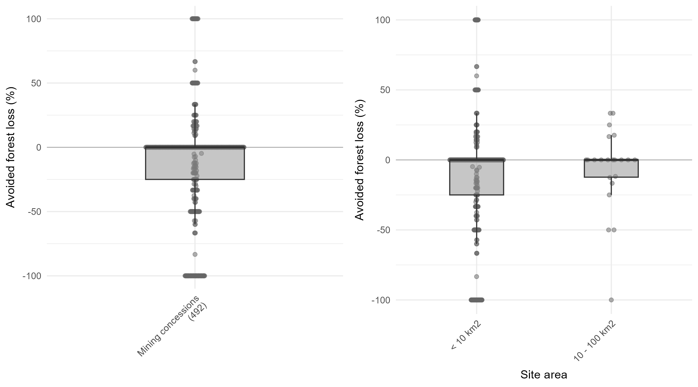

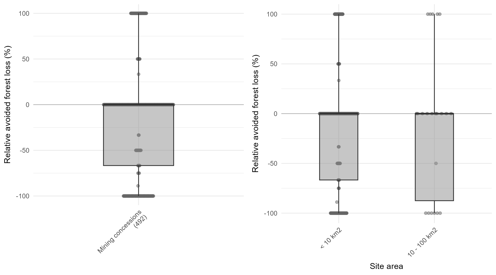
